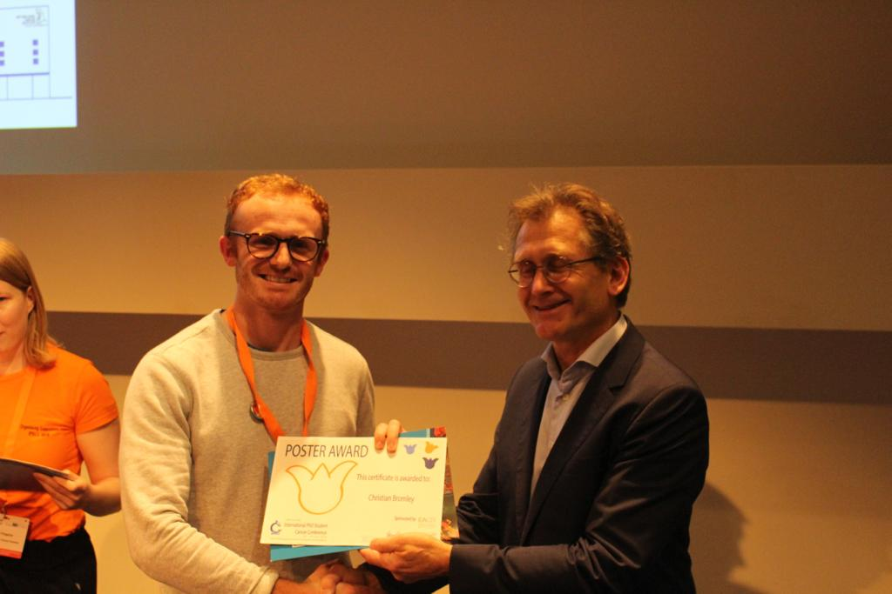

```{r setup, include=FALSE}
knitr::opts_chunk$set(echo = TRUE)
```


__Here's my story so far__

I grew up on the Wirral, and in case you've never heard of the "paradise peninsula" itself you can take a look below.

<iframe src="https://www.google.com/maps/embed?pb=!1m18!1m12!1m3!1d152483.47756872556!2d-3.2234090053387896!3d53.33333247961921!2m3!1f0!2f0!3f0!3m2!1i1024!2i768!4f13.1!3m3!1m2!1s0x487ad819e78b6473%3A0x5855af619d4d5206!2sWirral%20Peninsula!5e0!3m2!1sen!2suk!4v1612130774206!5m2!1sen!2suk" width="600" height="450" frameborder="0" style="border:0;" allowfullscreen="" aria-hidden="false" tabindex="0"></iframe>


I went to university almost a decade ago now as you will be able to see below...


```{r, echo=FALSE, error=FALSE, message=FALSE,warning=FALSE}
library(ggplot2)
library(ggrepel)
library(dplyr)
life <- data.frame(life_stage = c("Growing up", "University part 1", "GSK industrial placement", "University part 2", "AZ Alderley Edge", "AZ Cambridge", "University again/CRUK PhD"), 
            role = c("Messing around", "Biomedical science", "In vitro immunology", "Biomedical science", "Animal technician", "In vitro oncology & early clinical development", "Computational biologist & bioinformatician in cancer immunology"),       
           months = c((18*12)+2, 2*12, 1*12,1*12, 8, 2*8, (3*12)+4),
           me = rep("My life", 7))
life$life_stage <- factor(life$life_stage, levels = rev(c("Growing up", "University part 1", "GSK industrial placement", "University part 2", "AZ Alderley Edge", "AZ Cambridge", "University again/CRUK PhD")))
life <- life %>%
  mutate(years = months / 12)
ggplot(life, aes(me, years))+
  geom_bar(aes(fill=life_stage), stat="identity")+
  #geom_label(aes(label = role, hjust = 0))+
  scale_fill_brewer(palette="Dark2")+
  theme_minimal()+
  labs(x="", y="Years")+
  scale_y_continuous(limits=c(0,30), breaks=c(0,10,20,30))+
  coord_flip()
```

There's a long way to go.

__PhD life__

I'm currently studying for a PhD in bioinformatics and cancer immunology. 

Here's me getting a poster award from Nobel prize winner [Ben Feringa](https://en.wikipedia.org/wiki/Ben_Feringa) at the International PhD Students in Cancer Conference 2019.



__In the future__

I'm going to be doing a _lot__ more art, but for now I will stick to the science. I'll be trying to update this website regularly with some blogposts and other random content if I find the time in and around my PhD. 


