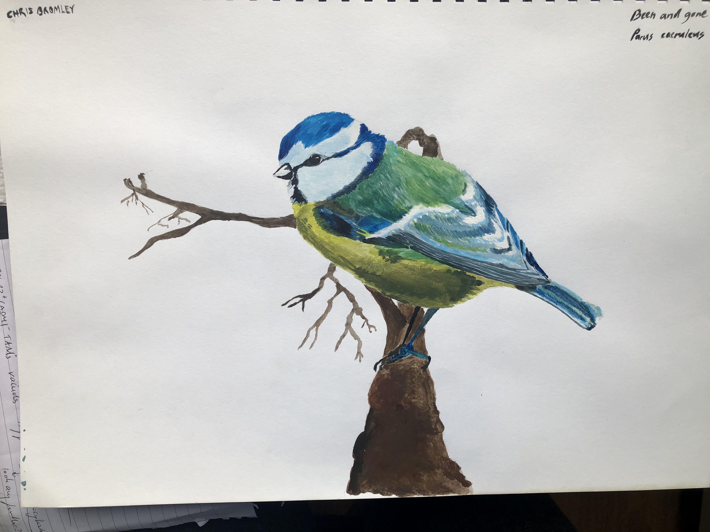
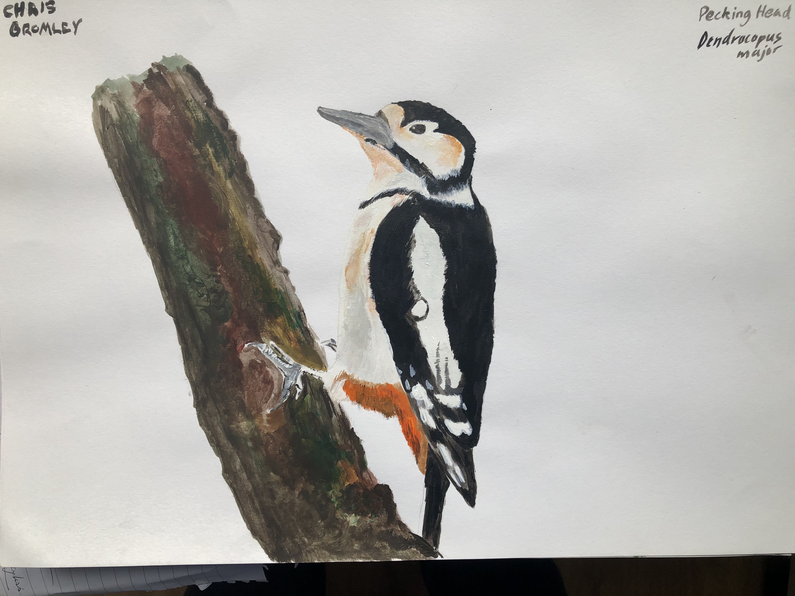
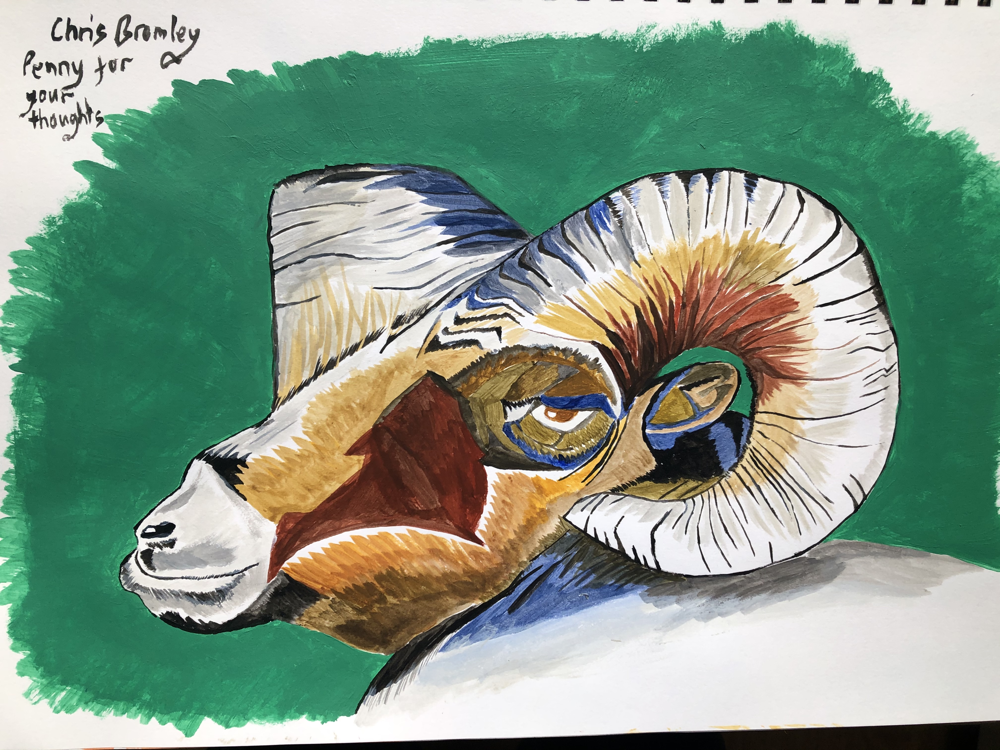
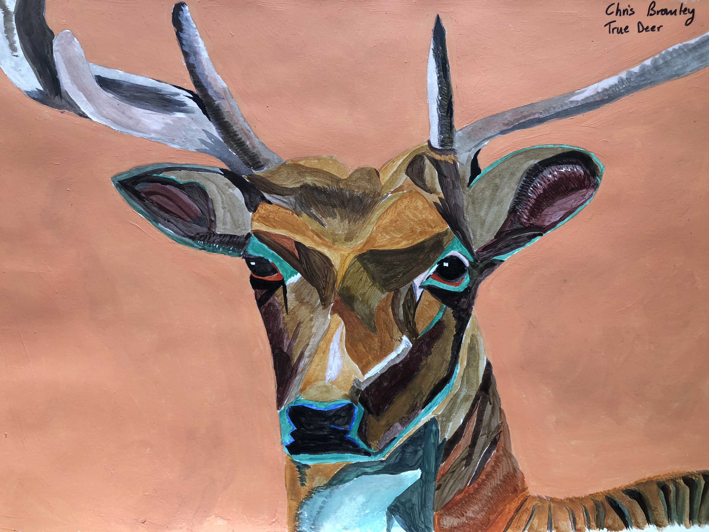
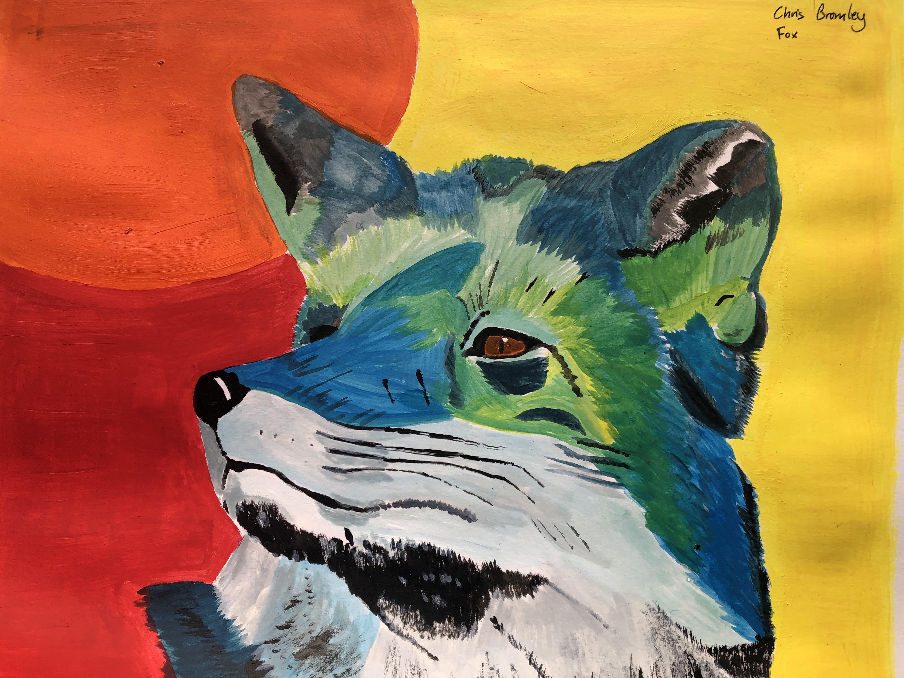
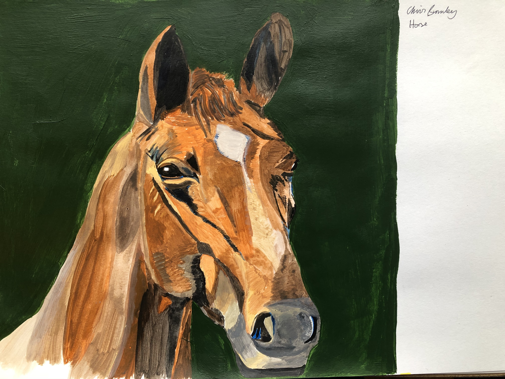
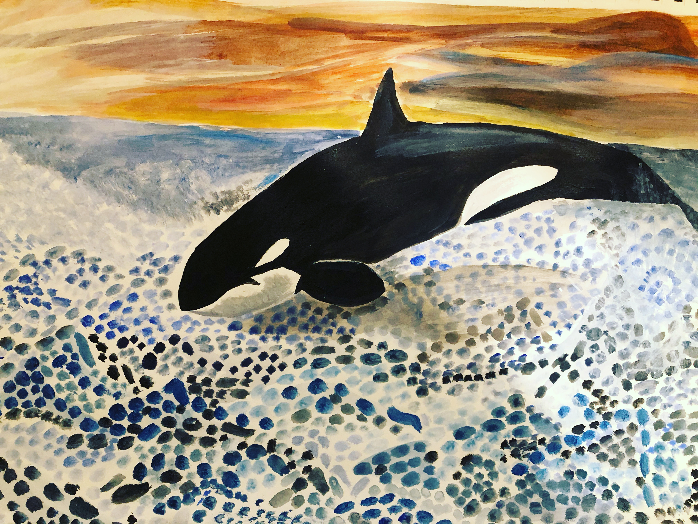
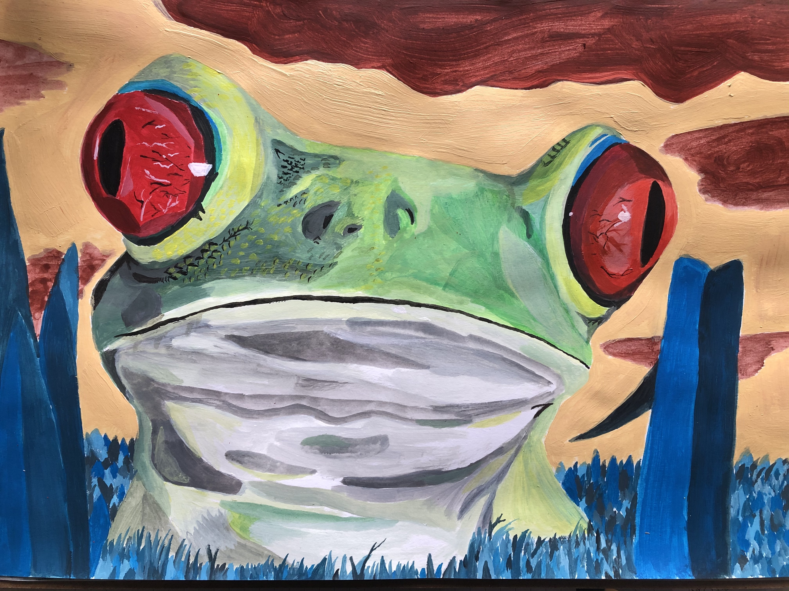
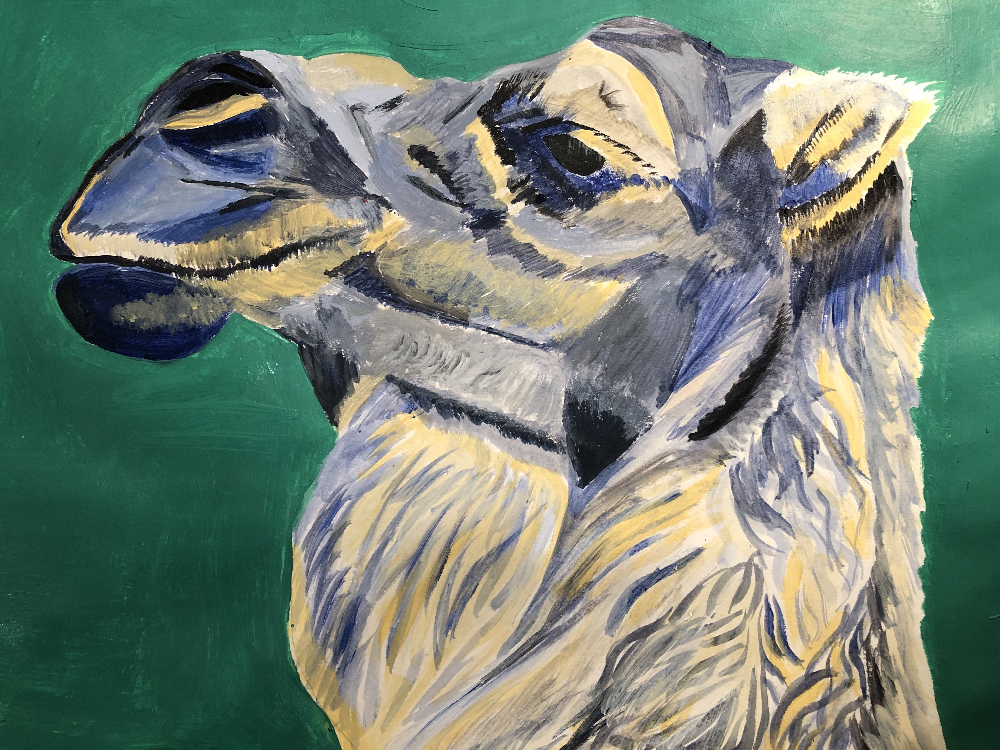

# Blue Tit

We had a great time watching these active little birds in the garden during the first lockdown and this was my first attempt at painting an animal. I got a bit obsessed from this point.

# Woodpecker

I probably couldn't have told you what a woodpecker even looks like before 2020. 

# Ram

# Deer

This is my absolute favourite. We saw plenty of deer on our walks through the Worcestershire countryside throughout 2020.

# Fox

I really wish I'd picked more of a dull background but never mind, it's too late now!

# Horse

Got to be Red Rum hasn't it...

# Orca

I really haven't got to grips with how you paint the sea. I thought I'd just do it in blobs of paint instead. 

# Frog

Things got really weird here. 

# Camel

There was a piece in the latest David Attenborough series about camels in Mongolia that eat snow. That was my inspiration for this one.

