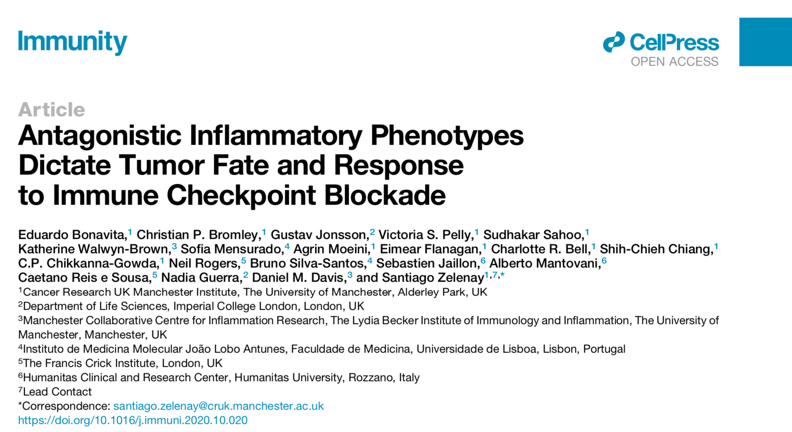

```{r setup, include=FALSE}
knitr::opts_chunk$set(echo = TRUE)
```

# NK cells, cancer inflammation and anti-tumour immunity



We recently published a paper in [Immunity](https://pubmed.ncbi.nlm.nih.gov/33220234/) if you want to learn about Natural Killer cells, inflammation and cancer!

More to come...