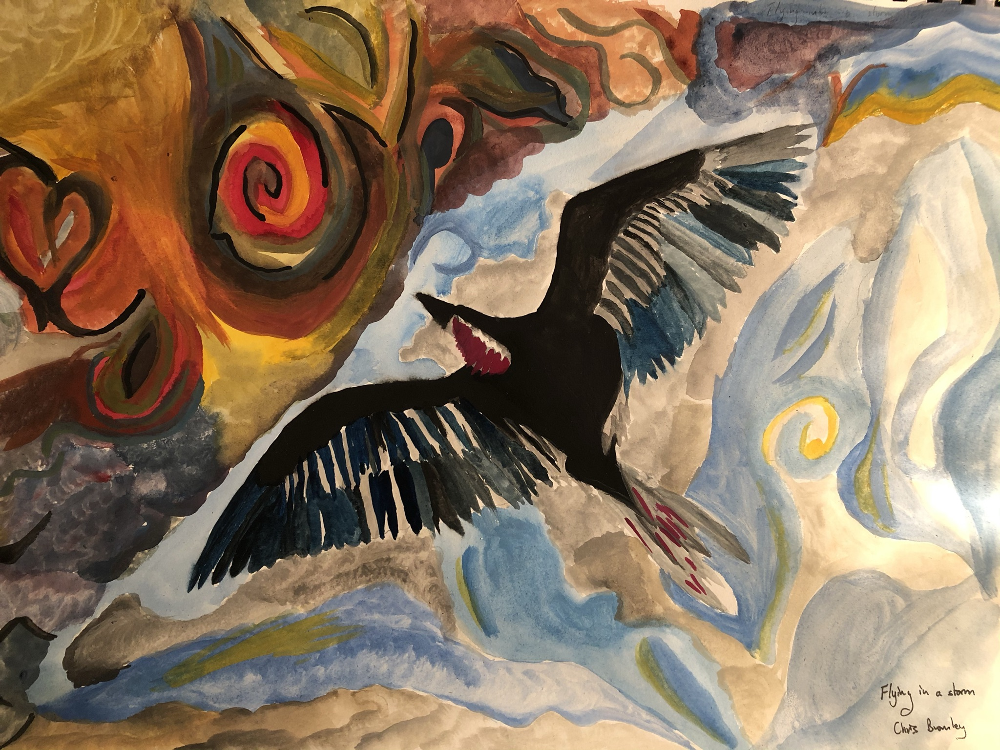
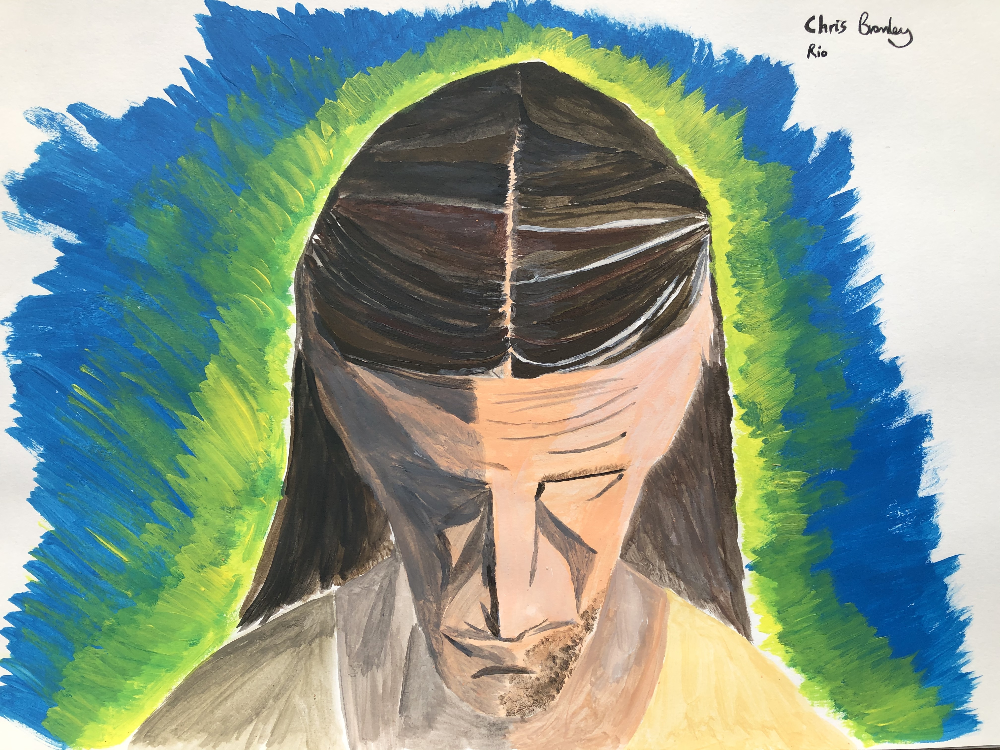
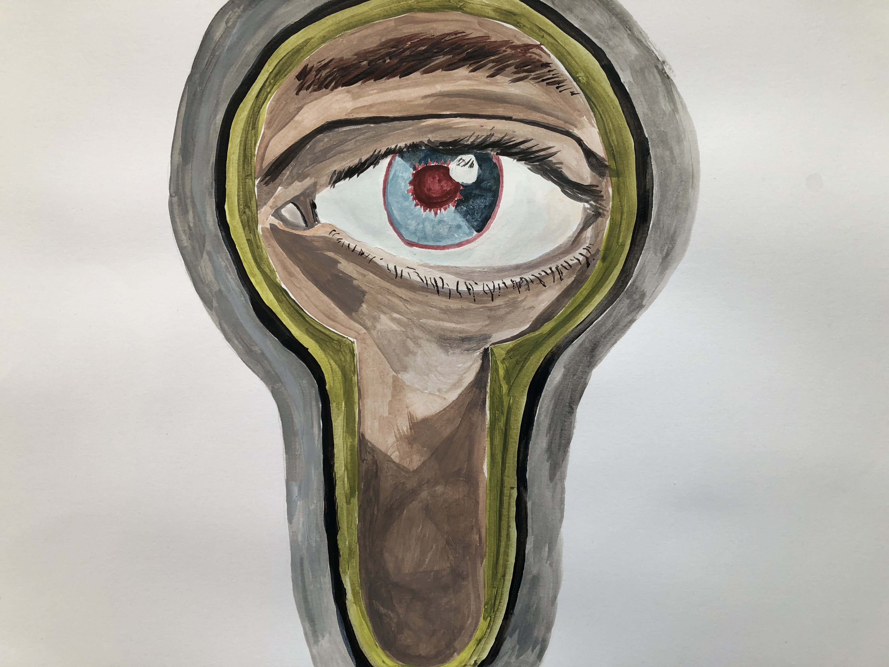

# Flying into a Storm

This was my first go at painting with gouache. I'd never heard of gouache before in my life. I thnk I'll stick to the acryllics mind...

# Rio

I had this idea of painting Christ the Redeemer from a weird angle, but got it slightly wrong. In fact, I decided from this point not to paint humans. Too difficult for a novice! (and animals are way more fun anyway)

# The Eye

After almost a year of lockdown restrictions you  begin to feel like you're looking through a keyhole into the past dreaming of the fun that used to take place.

